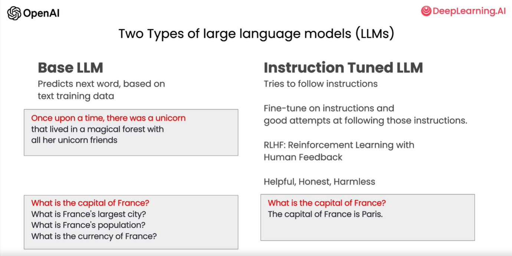
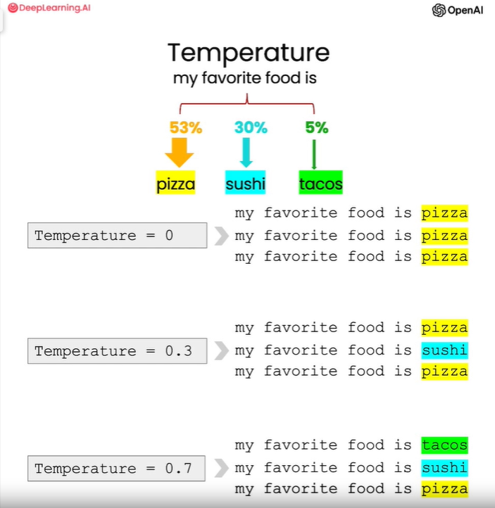

#### Base LLM vs. Instructed Tuned LLM



#### Notes on using the OpenAI API outside of this classroom

To install the OpenAI Python library:
```
!pip install openai
```

The library needs to be configured with your account's secret key, which is available on the [website](https://platform.openai.com/account/api-keys). 

You can either set it as the `OPENAI_API_KEY` environment variable before using the library:
 ```
 !export OPENAI_API_KEY='sk-...'
 ```

Or, set `openai.api_key` to its value:

```
import openai
openai.api_key = "sk-..."
```


#### A note about the backslash
- In the course, we are using a backslash `\` to make the text fit on the screen without inserting newline '\n' characters.
- GPT-3 isn't really affected whether you insert newline characters or not.  But when working with LLMs in general, you may consider whether newline characters in your prompt may affect the model's performance.


**Helper function**
Throughout this course, we will use OpenAI's `gpt-3.5-turbo` model and the chat completions endpoint.

#### Prompting Principles:

**Principle 1:** Write clear and specific instructions

**Tactic 1:** Use delimiters to clearly indicate distinct parts of the input

    Delimiters can be anything like: ```, """, < >, <tag> </tag>, :
    
**Tactic 2:** Ask for a structured output

    `JSON`, `HTML`
    
**Tactic 3:** Ask the model to check whether conditions are satisfied

**Tactic 4:** "Few-shot" prompting

**Principle 2: Give the model time to “think”**

**Tactic 1:** Specify the steps required to complete a task

Ask for output in a specified format

**Tactic 2:** Instruct the model to work out its own solution before rushing to a conclusion

#### Model Limitations: Hallucinations
Boie is a real company, the product name is not real.
```
prompt = f"""
Tell me about AeroGlide UltraSlim Smart Toothbrush by Boie
"""
response = get_completion(prompt)
print(response)
```
**Here is the response:**
```
The AeroGlide UltraSlim Smart Toothbrush by Boie is a high-tech toothbrush that uses advanced sonic technology to provide a deep and thorough clean. It features a slim and sleek design that makes it easy to hold and maneuver, and it comes with a range of smart features that help you optimize your brushing routine.

One of the key features of the AeroGlide UltraSlim Smart Toothbrush is its advanced sonic technology, which uses high-frequency vibrations to break up plaque and bacteria on your teeth and gums. This technology is highly effective at removing even the toughest stains and buildup, leaving your teeth feeling clean and refreshed.

In addition to its sonic technology, the AeroGlide UltraSlim Smart Toothbrush also comes with a range of smart features that help you optimize your brushing routine. These include a built-in timer that ensures you brush for the recommended two minutes, as well as a pressure sensor that alerts you if you're brushing too hard.

Overall, the AeroGlide UltraSlim Smart Toothbrush by Boie is a highly advanced and effective toothbrush that is perfect for anyone looking to take their oral hygiene to the next level. With its advanced sonic technology and smart features, it provides a deep and thorough clean that leaves your teeth feeling fresh and healthy.
```
#### Model parameters

One of the model's input parameters is called "**temperature**" which allows you to vary the degree of exploration and variety in the model's responses. So you can think of temperature as the degree of exploration or randomness of the model.


